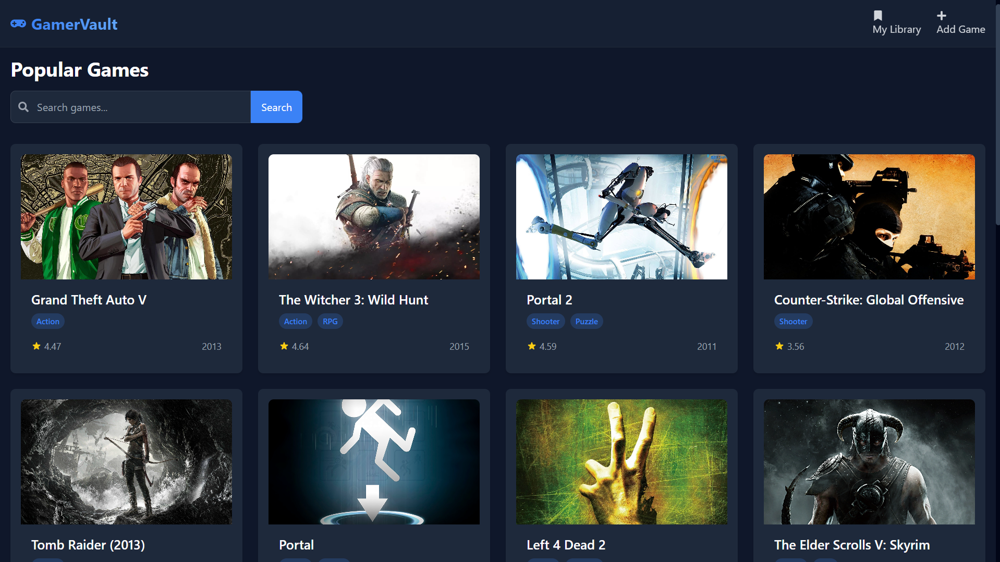
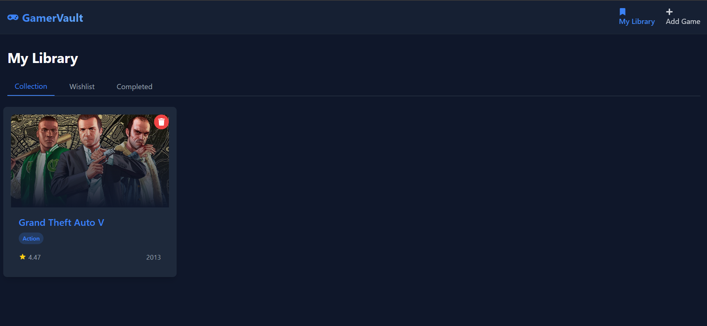
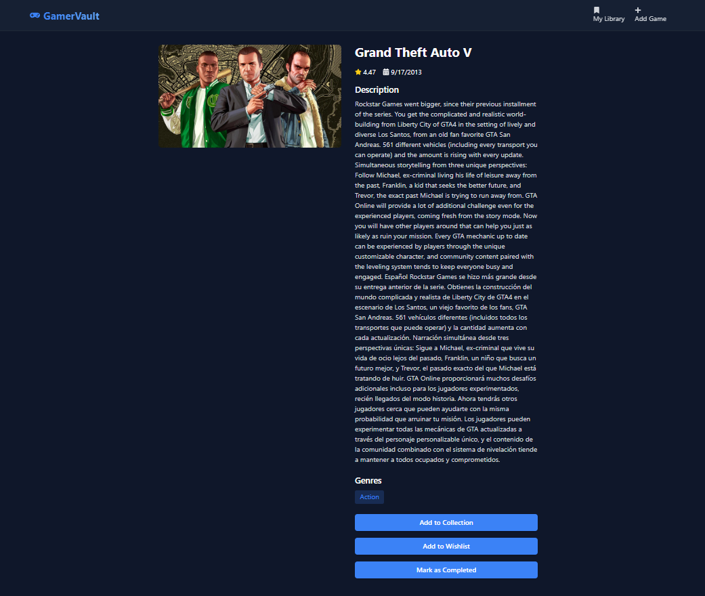
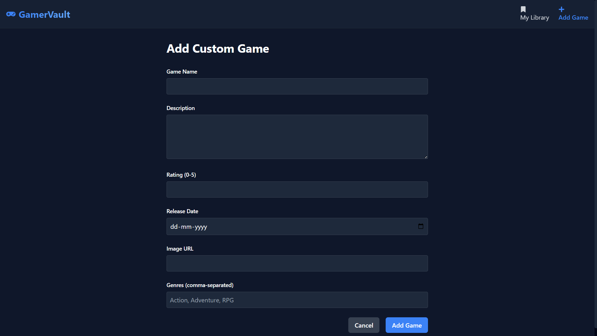

# GameVault

A modern React application for managing your video game collection, built with React, React Router, Context API, and Tailwind CSS.

## LINK:https://gamerv.netlify.app/

## Features

- Browse popular games from the RAWG Video Games API
- View detailed game information
- Organize games into Collection, Wishlist, or Completed categories
- Add custom games with form validation
- Responsive design for both mobile and desktop
- Modern UI with Tailwind CSS


## 🛠 Tech Stack

- **React.js** (Functional Components + Hooks)
- **React Router** for routing
- **React Context API** for global state
- **Tailwind CSS** for styling
- **RAWG Video Games** API for game data
- **Axios** for API requests
- **JSONPlaceholder** for mock API
- **Git & GitHub** for version control
- **Netlify** for deployment

## Images!





### Installation

1. Clone the repository:
```bash
git clone https://github.com/yourusername/gamevault.git
cd gamevault
```

2. Install dependencies:
```bash
npm install
```

3. Create a `.env` file in the root directory and add your RAWG API key:
```
VITE_RAWG_API_KEY=your_api_key_here
```

4. Start the development server:
```bash
npm run dev
```

5. Open [http://localhost:5173](http://localhost:5173) in your browser.

## Project Structure

```
gamevault/
├── src
|   |── screenshots/
|       ├── GameAddPage.png
|       ├── GameDetailsPage.png
|       ├── HomePage.png
|       └── LibraryPage.png
│   ├── components/
│   │   ├── GameCard.jsx
│   │   └── Navbar.jsx
│   ├── context/
│   │   └── GameContext.jsx
│   ├── pages/
│   │   ├── Home.jsx
│   │   ├── GameDetails.jsx
│   │   ├── MyLibrary.jsx
│   │   └── AddGame.jsx
│   ├── App.jsx
│   └── main.jsx
├── public/
├── .env
├── package.json
└── README.md
```

## Usage

1. **Home Page**: Browse popular games from the RAWG API
2. **Game Details**: Click on any game to view detailed information
3. **My Library**: View and manage your saved games in different categories
4. **Add Game**: Add custom games to your collection

## Contributing

1. Fork the repository
2. Create your feature branch (`git checkout -b feature/amazing-feature`)
3. Commit your changes (`git commit -m 'Add some amazing feature'`)
4. Push to the branch (`git push origin feature/amazing-feature`)
5. Open a Pull Request


## Acknowledgments

- [RAWG Video Games API](https://rawg.io/apidocs)
- [React](https://reactjs.org/)
- [Tailwind CSS](https://tailwindcss.com/)
